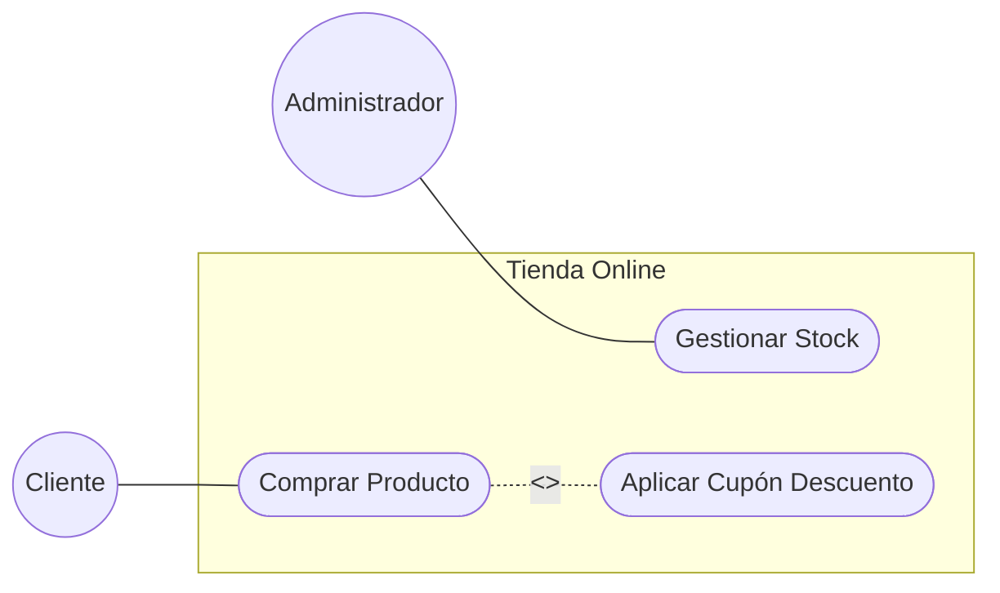

EJERCICIO 1:

```mermaid
graph LR 
Usuario((Usuario))
subgraph "Sistema de Luces"
CU1([Encender Luces])
CU2([Apagar Luces])
end
Usuario --- CU1
Usuario --- CU2
```
EJERCICIO 2:

```mermaid
graph LR
Cliente((Cliente))
Administrador((Administrador))
subgraph "Tienda Online"
CU1([Comprar Producto])
CU2([Gestionar Stock])
CU3([Aplicar Cupón Descuento])
end
Cliente --- CU1
CU1-. <<extends>> .-CU3

Administrador --- CU2
```
