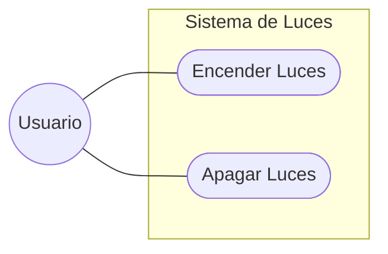
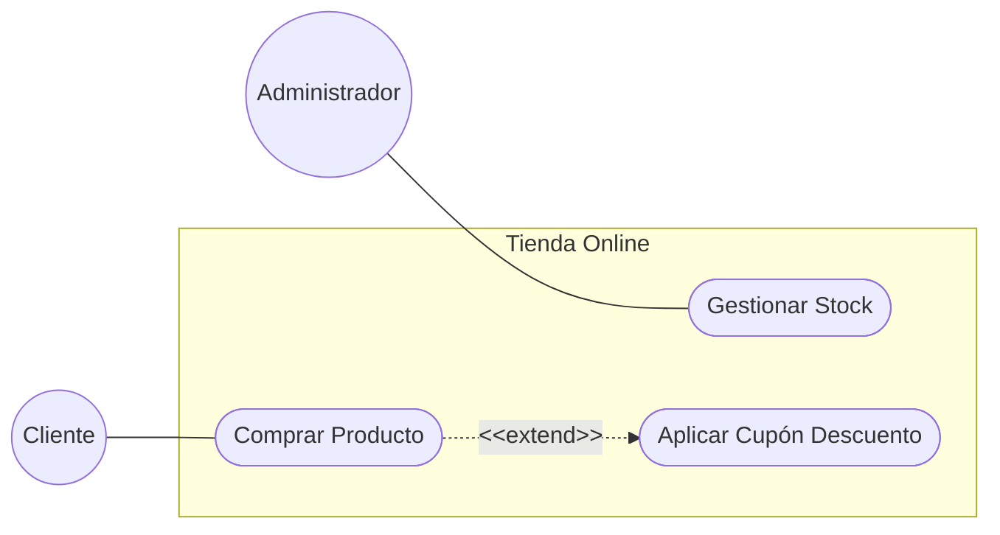
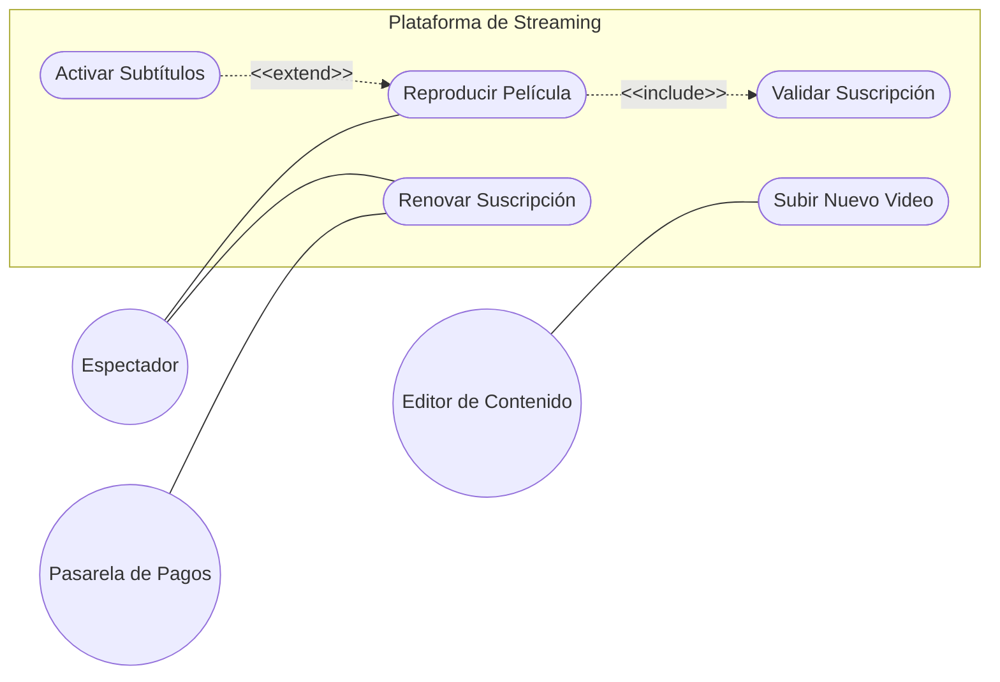

EJERCICIO 1:

```mermaid
graph LR 
Usuario((Usuario))
subgraph "Sistema de Luces"
CU1([Encender Luces])
CU2([Apagar Luces])
end
Usuario --- CU1
Usuario --- CU2
```
EJERCICIO 2:

```mermaid
graph LR
Cliente((Cliente))
Administrador((Administrador))
subgraph "Tienda Online"
CU1([Comprar Producto])
CU2([Gestionar Stock])
CU3([Aplicar Cupón Descuento])
end
Cliente --- CU1
CU1-.->|&lt;&lt;extend&gt;&gt;| CU3

Administrador --- CU2
```
EJERCICIO 3:

```mermaid
graph LR
Espectador((Espectador))
Editor((Editor de Contenido))
Pago((Pasarela de Pagos))
subgraph "Plataforma de Streaming"
    CU1([Reproducir Película])
    CU2([Validar Suscripción])
    CU3([Activar Subtítulos])
    CU4([Subir Nuevo Video])
    CU5([Renovar Suscripción])
end

CU1-.->|&lt;&lt;include&gt;&gt;| CU2
CU3-.->|&lt;&lt;extend&gt;&gt;| CU1
Espectador --- CU1
Espectador --- CU5

Editor --- CU4

Pago --- CU5
```
